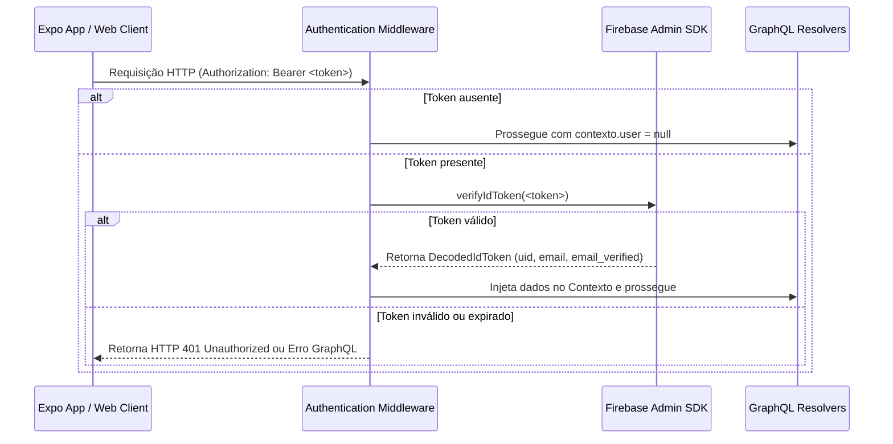

# Backend Authentication Context Specification

## Status

Approved

## Objective

Planejar e especificar os detalhes do contexto de autenticação no backend (Node.js/GraphQL) utilizando o Firebase Admin SDK, definindo os fluxos de extração e validação do token, a estrutura do contexto de segurança do GraphQL e os limites de autorização na camada de dados.

---

## 1. Fluxo de Validação de Token (HTTP Middleware)

A verificação do estado de identidade é feita na camada de transporte HTTP antes que a requisição seja entregue ao servidor do Apollo/GraphQL.



### Regras da Middleware:
- **Extração:** A middleware busca pelo cabeçalho `Authorization: Bearer <ID_TOKEN>`.
- **Flexibilidade:** Caso o cabeçalho não seja enviado, a requisição **não é bloqueada imediatamente na middleware**. O contexto do usuário (`context.user`) é definido como `null`, permitindo que operações públicas (como a query de saúde do sistema ou telas públicas) sejam executadas.
- **Validação estrita:** Se o cabeçalho for enviado, o token *deve* ser válido. Se estiver inválido, expirado ou malformado, a middleware deve retornar um erro HTTP `401 Unauthorized` ou lançar um erro específico no GraphQL antes de chamar qualquer resolver.

---

## 2. Estrutura do Contexto GraphQL

Após a validação bem-sucedida do token pelo Firebase Admin SDK, o objeto resultante é mapeado para a seguinte estrutura injetada no contexto do Apollo Server:

```typescript
export interface AuthUser {
  id: string;          // Firebase UID (mapeia para decodedToken.uid)
  email: string;       // E-mail do usuário
  emailVerified: boolean; // Flag indicando se o e-mail foi verificado
}

export interface GraphQLContext {
  requestId: string;   // Gerado pela middleware de logging/rastreabilidade
  user: AuthUser | null; // Nulo se a requisição não estiver autenticada
}
```

### Regra de Escopo:
O contexto deve ser gerado na inicialização do Apollo Server:
```typescript
const server = new ApolloServer<GraphQLContext>({
  typeDefs,
  resolvers,
  context: async ({ req }) => {
    // req.user é populado pela middleware de autenticação prévia
    return {
      requestId: req.id || generateRequestId(),
      user: req.user || null,
    };
  },
});
```

---

## 3. Propagação do UID na Camada de Dados

Para garantir o isolamento e segurança dos dados financeiros de cada usuário (Multi-tenancy a nível de banco de dados), a propagação do Firebase UID deve seguir as seguintes regras:

1. **Assinatura de Serviços e Repositórios:**
   Todas as funções e métodos de consulta ou modificação de dados pertencentes a usuários devem aceitar explicitamente o parâmetro `userId` (Firebase UID).
   
   *Exemplo de Assinatura:*
   ```typescript
   class ExpenseRepository {
     async findManyByUserId(userId: string, filters: ExpenseFilters): Promise<Expense[]> {
       // SQL implícito: SELECT * FROM expenses WHERE user_id = :userId
     }
     
     async create(userId: string, data: CreateExpenseInput): Promise<Expense> {
       // SQL implícito: INSERT INTO expenses (user_id, ...) VALUES (:userId, ...)
     }
   }
   ```

2. **Isolamento Implícito nos Resolvers:**
   Nenhum resolver de queries ou mutações autenticadas deve aceitar o `userId` vindo dos argumentos da query (GraphQL `args`). O `userId` deve ser extraído **exclusivamente** do `context.user.id`.
   
   *Exemplo de Segurança:*
   ```typescript
   const resolvers = {
     Query: {
       myIncomes: async (parent, args, context) => {
         if (!context.user) {
           throw new AuthenticationError('Você precisa estar autenticado.');
         }
         return incomeService.getIncomesForUser(context.user.id);
       }
     }
   };
   ```

---

## 4. Tratamento de Erros de Autenticação e Autorização

Quando uma operação protegida for acessada sem credenciais adequadas, o backend deve lançar erros em conformidade com as melhores práticas do GraphQL:

- **Não Autenticado (UNAUTHENTICATED):**
  Lançado quando `context.user` é nulo em uma query ou mutação que exige autenticação.
  - Código de extensão GraphQL: `UNAUTHENTICATED`
  - Código HTTP correspondente: `401 Unauthorized`

- **Acesso Negado (FORBIDDEN):**
  Lançado quando o usuário está autenticado, mas tenta acessar ou alterar um recurso que pertence a outro Firebase UID (detecção de quebra de barreira de acesso na camada de banco de dados).
  - Código de extensão GraphQL: `FORBIDDEN`
  - Código HTTP correspondente: `403 Forbidden`

---

## Critérios de Aceite para Futura Implementação

- [ ] A middleware de autenticação deve capturar e validar corretamente tokens JWT emitidos pelo Firebase.
- [ ] A middleware do Express deve injetar `req.user` ou manter `null` caso não haja cabeçalho de autenticação.
- [ ] O contexto do Apollo Server deve propagar `context.user` contendo `id`, `email` e `emailVerified` para todos os resolvers.
- [ ] Nenhum resolver protegido deve expor dados caso `context.user` seja nulo.
- [ ] Todas as chamadas de banco de dados de recursos financeiros devem incluir filtros com o `uid` vindo do contexto para impedir vazamento de dados entre usuários.
